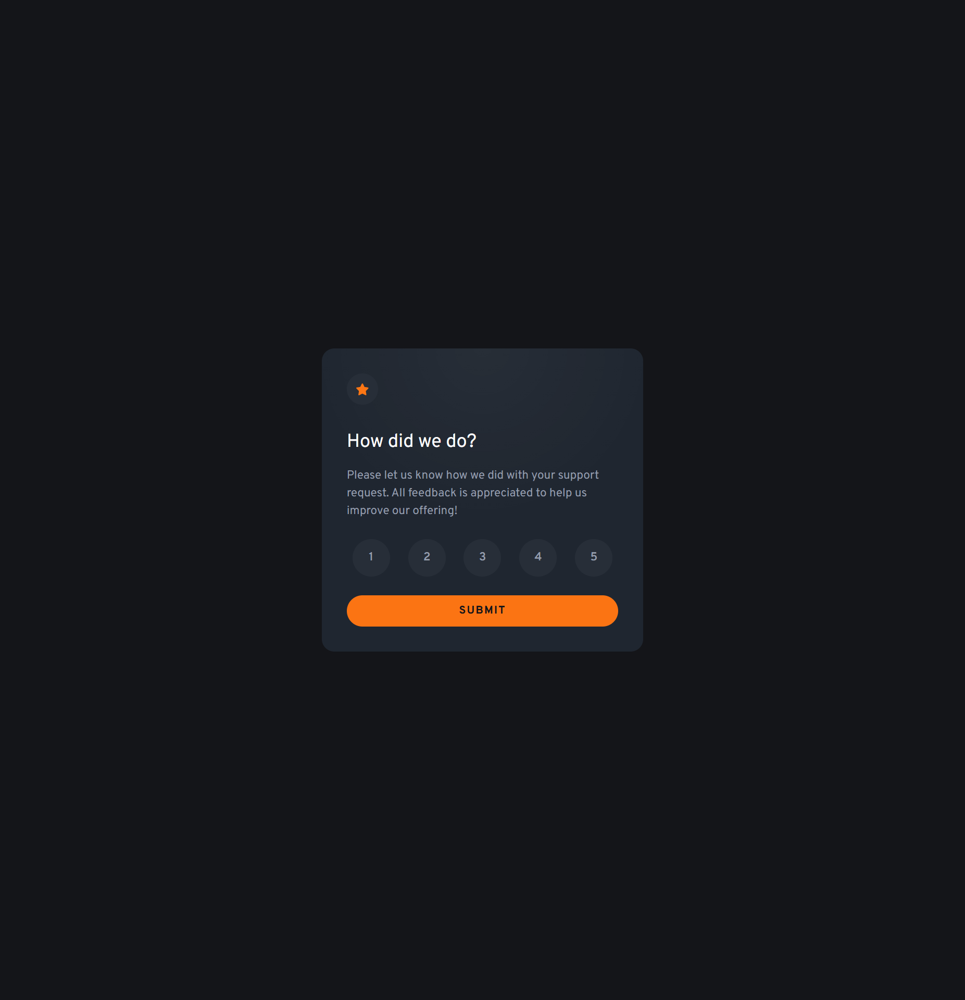

# Frontend Mentor - Interactive rating component solution

This is a solution to the [Interactive rating component challenge on Frontend Mentor](https://www.frontendmentor.io/challenges/interactive-rating-component-koxpeBUmI). Frontend Mentor challenges help you improve your coding skills by building realistic projects. 

## Overview

### The challenge

Users should be able to:

- View the optimal layout for the app depending on their device's screen size
- See hover states for all interactive elements on the page
- Select and submit a number rating
- See the "Thank you" card state after submitting a rating

### Screenshot

### Links

- Solution URL: [Solution URL](https://github.com/LINDECKER-Charles/FM-InteractiveRatingComponent2)
- Live Site URL: [Live site URL](https://fm-interactive-rating-component2-6n.vercel.app)

## My process

### Built with

- Semantic HTML5 markup
- CSS custom properties
- Flexbox
- CSS Grid
- Mobile-first workflow
- TailwindCSS

### Useful resources 📚🔗🛠️

* [Tailwind CSS documentation](https://tailwindcss.com/docs)
* [Frontend Mentor](https://www.frontendmentor.io) for the challenge and design
* [Google Fonts](https://fonts.google.com/specimen/Figtree) to get the Figtree variable font

## Author 👤🖊️📇

* LinkedIn - [Charles LINDECKER](https://www.linkedin.com/in/charles-lindecker/)
* GitHub - [Charles LINDECKER](https://github.com/LINDECKER-Charles)
* Frontend Mentor - [@LINDECKER-Charles](https://www.frontendmentor.io/profile/LINDECKER-Charles)
